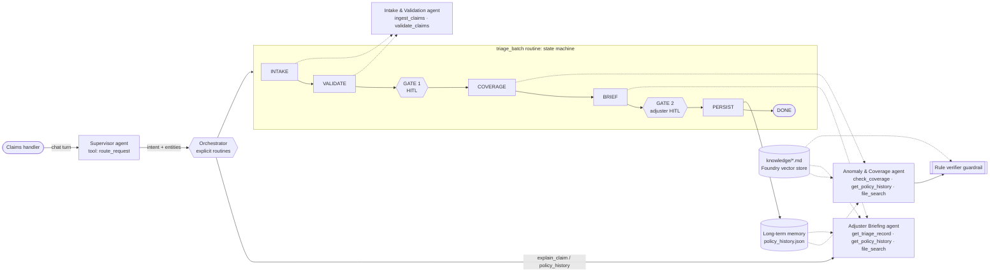

# Claims Triage Assistant: a multi-agent system on Azure AI Foundry

A Supervisor agent and three specialist agents help an insurance claims handler triage a batch of
property claims. The Supervisor **uses an LLM to route requests**, and **the triage flow is an
explicit, code-defined state machine** with two human-in-the-loop checkpoints.

> All data in this repo is **synthetic**. No real policyholder or claims data is used.



## How each requirement is met

| Requirement | Where | How |
|---|---|---|
| **Foundry Agent Service, SDK** | [runtime/foundry.py](claims_triage/runtime/foundry.py) | `azure-ai-agents` `AgentsClient` against the Foundry **project endpoint**: `create_agent`/`update_agent`, threads, runs, `requires_action` → `submit_tool_outputs`, `files.upload_and_poll`, `vector_stores.create_and_poll`, `run_steps.list` |
| **4 agents created in code** | [agents.py](claims_triage/agents.py) | `AgentSpec`s for supervisor, intake, coverage, briefing. They are provisioned idempotently (a fingerprint of the instructions, tool schemas and model decides whether an agent is created, updated or reused). `python main.py setup` / `teardown` |
| **≥3 function tools with JSON schemas** | [skills.py](claims_triage/skills.py) | **6** skills (`ingest_claims`, `validate_claims`, `check_coverage`, `get_policy_history`, `get_triage_record`, `route_request`). Each has an explicit schema and is registered **only** to its owning agent(s), which the executor enforces (`tool_not_permitted`) |
| **Knowledge grounding** | [knowledge/](knowledge/), [knowledge.py](claims_triage/knowledge.py) | 3 markdown files (8 underwriting rules, 4 coverage rules, 6 fraud indicators) are uploaded to a Foundry **vector store**. `FileSearchTool` is attached to the Coverage and Briefing agents. The rules are **not** in any prompt |
| **Short-term memory** | [memory.py](claims_triage/memory.py) `SessionState` | One Foundry **thread per agent per session**. Thread IDs are persisted, so `--session X` resumes the same threads even from a new process. Example: the Intake agent must *remember* the `batch_id` from its earlier turn to validate it, and the Supervisor resolves "the theft one" or "it" |
| **Long-term memory** | [memory.py](claims_triage/memory.py) `LongTermMemory` | JSON store of **adjuster-approved** outcomes keyed by policy, written only after checkpoint 2. It is read by `check_coverage` (for the repeat-claim facts) and by `get_policy_history` |
| **Explicit routine + HITL** | [orchestrator.py](claims_triage/orchestrator.py) | `TRANSITIONS` table; each transition is validated, logged, check-pointed to the session file and wrapped in an OTel span. Checkpoint 1: proceed without the invalid claims? Checkpoint 2: accept, override (a reason is required) or defer |
| **Error handling** | see [table below](#error-handling) | Malformed files and rows, tool failures (retry + structured error), agent timeouts or failed runs (retry, then degrade), bad model JSON (repair prompt, then fallback), hallucinated rules (verifier) |
| **Observability** | [observability.py](claims_triage/observability.py) | Console log, a JSONL trace per session in `logs/`, and OpenTelemetry spans. With `ENABLE_TRACING=true` traces are exported to the project's Application Insights (Foundry portal → Tracing) using `AIAgentsInstrumentor` |

## Key design decisions (the part to defend)

1. **The LLM decides *what the user wants*; code decides *what happens next*.** The Supervisor's only
   tool is `route_request(intent, claim_ids, …)`. A full triage never lets the model pick the next
   step, because it runs the `TRANSITIONS` graph. I deliberately did **not** use Foundry "connected
   agents" for the triage flow, because that hands sequencing back to the model and makes it harder
   to audit.
2. **Skills compute facts; the knowledge base holds the rules; the model applies them.**
   `check_coverage` returns facts such as `days_since_inception=3` and `pct_of_limit=100.0`, and
   thresholds like "≤ 7 days" exist only in `knowledge/*.md`. Underwriting can change a rule without a
   code release.
3. **The model proposes, the rules verify.** Each KB rule carries a machine-checkable `Condition`. A
   safe, whitelisted AST evaluator (never `eval`) re-checks every rule against the facts and then:
   - drops hallucinated rule IDs,
   - adds rules the model missed,
   - marks cited rules whose condition is false as `unverified`,
   - lets the model *escalate* but never *downgrade*.

   Rules without a condition (FI-06) are shown as `model_judgement` and never escalate on their own.
4. **Memory is written only after human approval.** Long-term memory holds *decisions*, not model
   guesses. Claims that failed validation are stored as `incomplete`, so a corrected resubmission
   isn't blocked by the `ALREADY_PROCESSED` check.
5. **Conservative action ordering:** `route_to_investigator` > `request_documentation` >
   `auto_approve`. Every auto-approval still passes checkpoint 2, and the system never declines a
   claim on its own (UW-04).

## Quick start

```bash
python3 -m venv .venv && source .venv/bin/activate
pip install -r requirements.txt
python -m pytest -q                      # 18 tests, no Azure needed
```

### Mock mode (no Azure)
Mock mode is on automatically when `PROJECT_ENDPOINT` is unset, or you can force it with `--mock`.

### Live on Azure AI Foundry
1. Create a Foundry project and deploy a chat model (e.g. `gpt-4o`) that supports tool calling.
2. `az login`. Your identity needs the **Azure AI User** role on the project.
3. `cp .env.example .env` and set `PROJECT_ENDPOINT`, `MODEL_DEPLOYMENT_NAME` and `USE_MOCK_LLM=false`.
4. `python main.py setup` uploads the knowledge files, creates the vector store and creates the 4 agents.
5. Run the demo below with `--live`. Clean up afterwards with `python main.py teardown`.
6. Optional: `ENABLE_TRACING=true` makes spans show up under Foundry portal → Tracing.

## Demo script (≈10 minutes)

```bash
python main.py memory reset
python main.py routine                                   # show the explicit state machine

# Run 1 (February): C-2032 "Basement flooding" → COV-02 flood exclusion → saved to long-term memory
python main.py triage data/batches/2026-02_batch.json --as-of 2026-02-20 --session demo-feb

# Run 2 (September, new session): interactive, multi-turn, through the Supervisor
python main.py chat --session demo
  handler › triage data/claims.json          # walk through both checkpoints; try an override
  handler › triage C-1001                    # single claim: located in the data files automatically
  handler › why was C2031 flagged?           # FI-01 repeat water damage: recalls C-2032 from run 1
  handler › what about the theft one?        # thread memory resolves → C-2033
  handler › show the history for POL-5521    # long-term memory
  handler › /quit
python main.py ask --session demo "and is that one still pending?"   # new process, same threads

# Failure handling
python main.py triage data/samples/claims_sample_original.json --session chaos --yes \
    --fault bad_json --fault hallucination --fault agent_timeout --fault tool_timeout
python main.py triage data/samples/claims_messy.csv --session csv --yes
```

Each triage writes a Markdown adjuster report to `reports/` and a JSONL trace to `logs/`.

## Sample data and expected outcomes

`data/claims.json` holds the September batch. It contains the provided claims plus test cases for
every validation rule. C-2032 was moved into the February batch so that the **cross-run** memory
effect can be shown. The provided sample is kept unchanged in `data/samples/claims_sample_original.json`.

| Claim | Scenario | Result (after run 1) | Why |
|---|---|---|---|
| C-2031 | Burst pipe, 8,500 | 🔎 investigator | FI-01 repeat water claim (C-2032, 6 months earlier) + FI-03 prior flag. **Without run 1 it would be auto-approved.** |
| C-2031 (row 7) | Second submission | ✗ rejected | DUPLICATE_CLAIM_ID |
| C-2033 | Jewelry theft, 25,000 | 🔎 investigator | UW-01 3 days after inception, UW-02 100% of limit, COV-03 jewelry sub-limit, COV-04, UW-06, FI-04/05 notes |
| C-2034 | No loss date, amount 0 | 📄 documents | MISSING_FIELD, NON_POSITIVE_AMOUNT. The briefing also notes that POL-4410 expired on 2026-01-01 |
| C-2035 | Loss after report | 📄 documents | LOSS_AFTER_REPORT |
| C-2036 | POL-0000 | 📄 documents | UNKNOWN_POLICY |
| C-2037 | Fence, 1,800 | ✅ auto-approve | No rule fires (UW-07) |
| C-2038 | Fire reported 53 days late, 14,500 | 📄 documents | UW-05 late reporting, UW-06 desk review |
| C-2032 (Feb) | "Basement flooding" | 📄 documents | COV-02 flood exclusion: need the cause of loss |

Extensions to the provided data: I added `scheduled_items` to the policy records (for the jewelry
sub-limit) and two extra policies, POL-7730 and POL-6120. `claims_messy.csv` exercises truncated
rows, extra columns, non-numeric amounts, bad dates and ID normalisation (`c2044` → `C-2044`).

### Extended batch: `data/claims_extended.json` (C-1001 to C-1013)

These 13 synthetic claims sit on 4 extra synthetic policies (POL-1101 to POL-1104). Each record targets
a rule or path that the main batch doesn't cover. The batch is self-contained: its policies don't
overlap with the demo batches, so it gives the same results whatever is in long-term memory.

```bash
python main.py triage data/claims_extended.json
```

| Claim | Scenario | Result | Why |
|---|---|---|---|
| C-1001 to C-1003 | Three small claims on POL-1101 (hose burst, hail, vandalism) | ✅ auto-approve | No rule fires |
| C-1004 | 4th claim on POL-1101 in 12 months, second water claim | 🔎 investigator | FI-02 high frequency + FI-01 repeat peril |
| C-1005 | Deck fire after POL-1102 expired | 🔎 investigator | UW-04 loss outside the policy period |
| C-1006 | 18,000 garage fire on a 15,000 limit | 🔎 investigator | UW-03 exceeds the limit + UW-06 |
| C-1007 | 4,000 necklace theft; jewelry **is** scheduled | 📄 documents | COV-04 police report only; COV-03 sub-limit correctly does *not* fire |
| C-1008 | Earthquake damage | 🔎 investigator | COV-01 peril not covered by the homeowners form |
| C-1009 | Exactly 5,000 roof claim | ✅ auto-approve | FI-04 round-number fires as a `note` only, so there's no escalation |
| C-1010 | Leak reported 76 days after the loss | 📄 documents | UW-05 late reporting |
| C-1011 | Loss and report dated 2027 | ✗ rejected | FUTURE_DATE |
| C-1012 | Policy number `PL-1103` | ✗ rejected | INVALID_POLICY_FORMAT |
| C-1013 | Small smoke claim with no description | ✅ auto-approve | Valid with a MISSING_DESCRIPTION warning |

Triaging the same file twice rejects already-finalised claims as `ALREADY_PROCESSED`, which is the
resubmission check working as intended. Run `python main.py memory reset` between repeat runs.

## Error handling

| Failure | Handling | Demo |
|---|---|---|
| Missing, unreadable or malformed file | `IngestError` → routine goes to `ABORTED` with a clear message | `triage data/nope.json` |
| Malformed rows (CSV truncated or extra cells, non-object JSON) | Row skipped and listed under `unparseable_rows`; the rest continue | `claims_messy.csv` |
| Bad field values | Validation issue codes; claim excluded at checkpoint 1 and sent for documents | `C-2041`, `C-2042` |
| Tool raises a transient error | Executor retries with backoff, then returns `{"error": "tool_unavailable"}` to the model | `--fault tool_timeout` |
| Tool bug or invalid arguments | Always returns structured JSON (`tool_failed` / `invalid_arguments` / `tool_not_permitted`); the agent loop never crashes | unit tests |
| Agent run times out or fails | Run cancelled → `AgentTimeoutError` → orchestrator retries (`max_run_attempts`). Rate limits back off | `--fault agent_timeout` |
| Model returns invalid JSON | One repair prompt on the same thread, then deterministic fallback flagged for human attention | `--fault bad_json` |
| Model cites a non-existent rule or misses one | Verifier drops or adds it; the discrepancy is shown at checkpoint 2 | `--fault hallucination` |
| Model downgrades the recommendation | `enforce_briefing` restores the floor action | unit tests |
| Agent skips a required tool | Post-condition check → orchestrator calls the skill directly (`routine.fallback`) | trace |
| Corrupt memory file | Backed up to `*.corrupt.json` and started fresh | n/a |

## What is mocked, and why

Mock mode exists for demos without Azure quota, as the brief allows. **Only the model's reasoning and
server-side file_search are mocked.**

The mock agents:
- receive the same messages,
- call the same skills through the same executor (so schema checks, retries, logging and memory are
  real),
- keep per-thread history,
- return the same output formats.

`file_search` is replaced by keyword retrieval over the same `knowledge/*.md` files. All SDK code in
`runtime/foundry.py` stays in place and is also exercised offline by `tests/test_foundry_runtime.py`
against the real `azure-ai-agents` model classes with a fake client.

## Verified live on Azure AI Foundry

The full demo has been run live against a Foundry project (West US 3) using **gpt-4.1-mini**
(Global Standard deployment):

- **Provisioning:** `setup` uploads 3 knowledge files, builds the vector store and creates the 4
  agents. Re-running it updates agents in place when their prompt or tools change.
- **Time:** about 70–75 seconds per full triage.
- **Cost:** about **$0.014** per full triage (about 25–30K input and 1–2.5K output tokens), as
  measured from the `usage` field that each `agent.run.end` event records in the trace.
- **Multi-turn chat works live.** "the theft one" resolves to C-2033, and "why was C2031 flagged?"
  cites FI-01 and FI-03 plus C-2032 "flagged about 6 months earlier" from long-term memory.
- **The guardrail catches real model slips, not just injected faults.** Each knowledge file fits in a
  single chunk, so `file_search` gives the model the entire knowledge base. Even so, gpt-4.1-mini
  sometimes misses low-severity rules on a long checklist (e.g. COV-03, UW-06, FI-04 on C-2033) or
  under-ranks the final action. The verifier added those rules back, and every final recommendation
  matched the expected outcome. A larger model (gpt-4.1, gpt-5-mini) would likely lower the
  discrepancy rate; the rate is logged as `guardrail.discrepancy` events.

SDK note: `azure-ai-projects` 2.x moved to the new Responses-based Foundry Agents API and no longer
exposes the classic `AgentsClient`. This project uses `azure-ai-agents`' `AgentsClient` directly with
the project endpoint, and uses `azure-ai-projects` for telemetry.

## Project layout

```
main.py                      CLI: chat · ask · triage · routine · memory · setup · teardown
claims_triage/
  agents.py                  4 AgentSpecs (instructions, file_search flag)
  skills.py                  6 function tools + JSON schemas + executor (validation, retry, logging)
  orchestrator.py            Supervisor handling, TRANSITIONS state machine, HITL gates, persistence
  guardrails.py              rule verifier + briefing floor enforcement
  knowledge.py               KB parser, safe condition evaluator, local retrieval (mock)
  memory.py                  SessionState (thread memory) + LongTermMemory (cross-run)
  observability.py           console + JSONL + OpenTelemetry / Azure Monitor / AIAgentsInstrumentor
  runtime/foundry.py         Azure AI Foundry Agent Service runtime
  runtime/mock.py            deterministic stand-in with the same contract
knowledge/                   underwriting_rules.md · coverage_matrix.md · fraud_indicators.md
data/                        claims.json · policy_coverage.json · batches/ · samples/ · memory/
tests/                       18 tests: validation, evaluator safety, guardrails, routine, memory, faults, Foundry loop, extended batch, triage by claim ID
docs/design-notes.md         trade-offs, scaling and likely review questions
docs/TEST_PLAN.md            full test plan: 114 cases across all requirements, mock + live
scripts/trace_summary.py     summarise a trace: state path, tokens/cost, tool errors, guardrail stats
```

## Limitations and next steps
- Swap the JSON long-term memory for **Azure AI Search** (hybrid search over past claim narratives) or
  the Foundry memory store, behind the same `LongTermMemory` interface.
- Checkpoints are console prompts. In production they'd be a queue or UI with async resume. State is
  already check-pointed after every transition.
- Add an evaluation set (labelled claims → expected action) and run Foundry evaluations in CI.
- Batch scaling: run deterministic facts on every claim, and send the LLM only the claims where a
  rule fires or the narrative matters.
